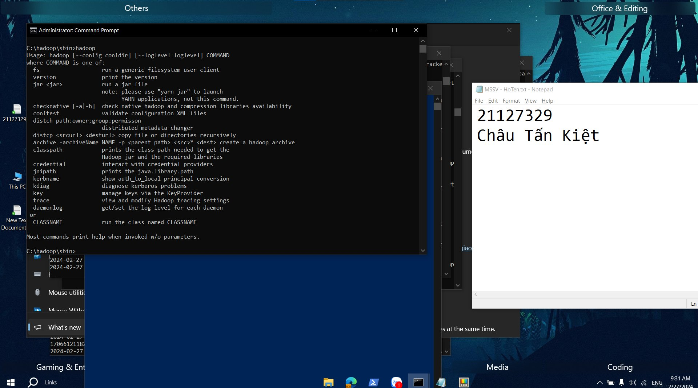
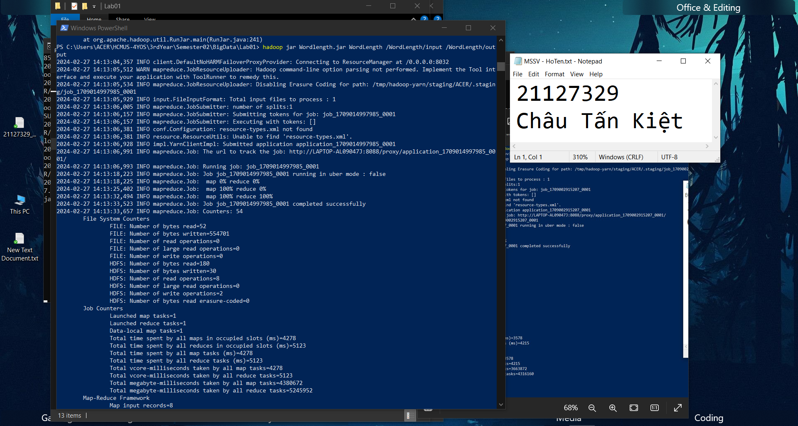
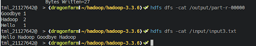
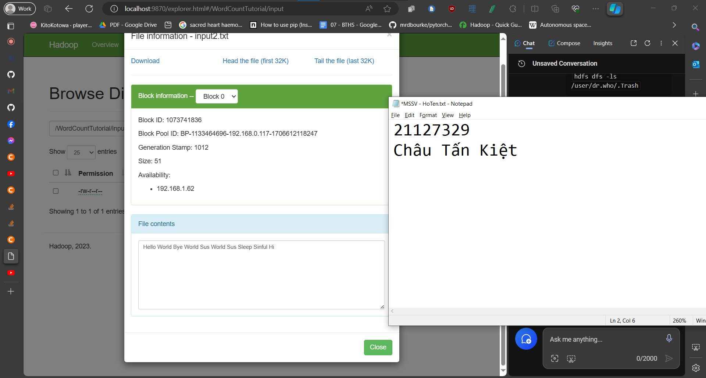
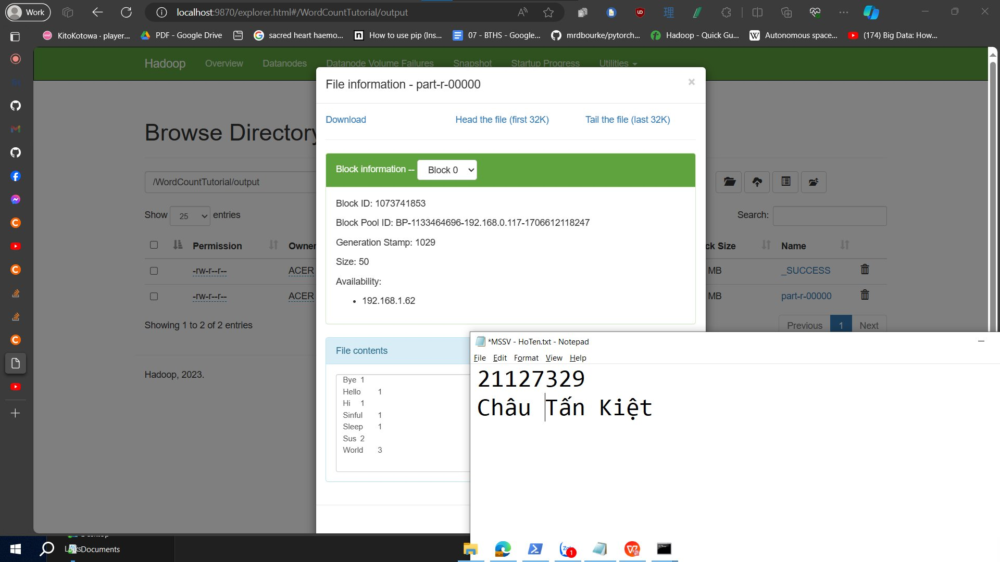

# Lab 01 Report: A Gentle Introduction to Hadoop

### Teacher in charge: Nguyễn Ngọc Thảo (KHMT1)

| Lab Instructors     |  Email                       | 
|---------------------|------------------------------|
| Đỗ Trọng Lễ         | dtle@selab.hcmus.edu.vn      |         
| Bùi Huỳnh Trung Nam | huynhtrungnam2001@gmail.com  |

### Group Name : Left4Dead
| No. | Student ID | Student Name     |
|-----|------------|----------------- |  
|  1  |  21127329  | Châu Tấn Kiệt    |
|  2  |  21127170  | Nguyễn Thế Thiện |
|  3  |  21127642  | Trịnh Minh Long  |

## Abstract
This lab aims to familiarize students with setting up a Hadoop cluster. Following this, 
students will explore Hadoop by developing a MapReduce program in Java, informed by 
study of the original paper on the MapReduce concept. Lastly, there are optional bonus assignments available for additional points. 

## Lab Progress
| No. | Task  | Expected output | Progress |
|-----|-------|-------------|---------|  
|  1  |  Setting up Single-node Hadoop Cluster | Students can install a Hadoop cluster/instance on their own device.  | 100% |
|  2  |  Introduction to MapReduce  | Students can research new concepts to master how to express scientific concepts and understanding.  | 100% |
|  3  |  Running a warm-up problem: Word Count | Students can verify their Hadoop cluster/instance is set up correctly and get used to run a MapReduce code in Hadoop.   | 100% |
|  4  |  Bonus | 4.1 Word Length Count | 100% |
|     |        | 4.2 Setting up Fully Distributed Mode | 0% |

## 1. Setting up Single-node Hadoop Cluster 
In this exercise, each member has installed a single node Hadoop cluster by following the tutorial from Apache Hadoop’s official documentation. When following the tutorial, the student needs to take screenshots of the installation and verify if Hadoop is installed correctly. The evidence is shown as below. The details of the images are available in the path `/docs/images`

| No. | Student ID | Student Name     | Hadoop command | Testing 
|-----|------------|----------------- | --- | -- |
|  1  |  21127329  | Châu Tấn Kiệt    |  |  |
|  2  |  21127170  | Nguyễn Thế Thiện | |  
|  3  |  21127642  | Trịnh Minh Long  | .webp) |  |

## 2. Paper Reading
We read and analyzed the original paper of MapReduce by Dean and Ghemawat and then answer the given questions:

### 1. How do the input keys-values, the intermediate keys-values, and the output keys-values relate? 

The input key-value pairs are made by dividing the input data into smaller blocks and mapping those blocks with corresponding key-value pairs, while output key-value pairs are from the Reduce section of MapReduce. Hence the input keys and values are drawn from a different domain than the output keys and values.\
Furthermore, the intermediate keys and values are from the same domain as the output keys and values, since the they are both outputs of functions which the inputs are in the type of key-value pairs.

### 2. How does MapReduce deal with node failures?
- Worker Failure\
The Master sets the status of its currently executing Reduce tasks to idle\
If a worker node fails, the master reschedules the tasks handled by the worker.
- Master Failure\
The whole MapReduce job gets restarted through a different master

### 3. What is the meaning and implication of locality? What does it use?
- The meaning of locality is the input data (managed by GFS) is stored on the local disks of the
machines that make up the cluster. 
- The implication is that it saves network bandwidth.
- This process is used by the local disks 

### 4. Which problem is addressed by introducing a combiner function to the MapReduce model?
- One disadvantage of MapReduce is its inefficiency and redundancy for some data processing tasks. 
- MapReduce can generate a lot of intermediate data, which needs to be shuffled, sorted, and transferred between nodes.
- Combiner function minimizes the number of key/value pairs that will be shuffled across the network and provided as input to the Reducer

## 3. Running a warm-up problem: Word Count 
In this section, we follow the tutorial to get the Example WordCount v1.0 [4]. Then we compiled the code to a JAR file, then run them in the installed Hadoop cluster/instance\
We run the example in 2 operating systems, Windows and Linux with the command:\
`hadoop jar <.jar file> WordCount <input directory in HDFS>  <output directory in HDFS>`\
Here's the example for input and output. The details of the images are available in the path `/docs/images`\
Input image: 

  

Output image:

  

## 4. Bonus
