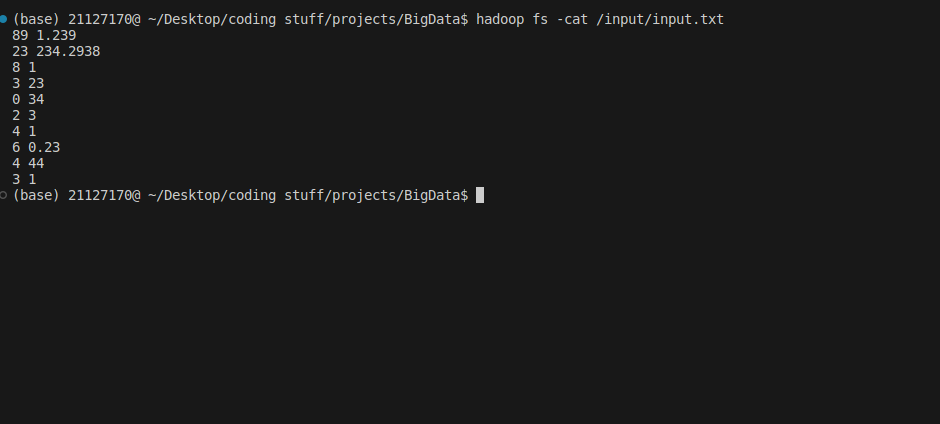
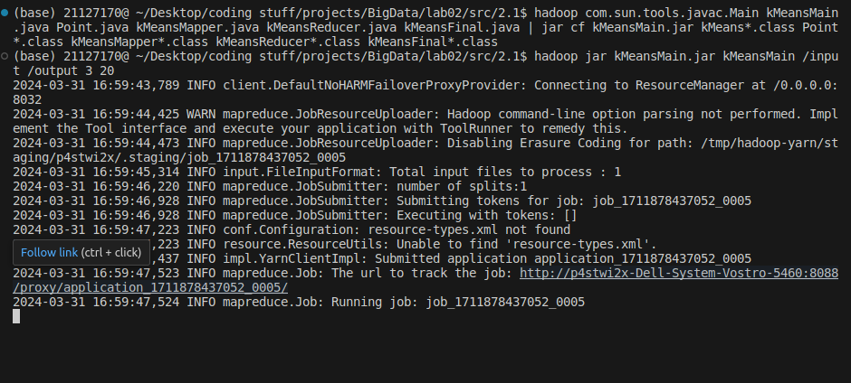
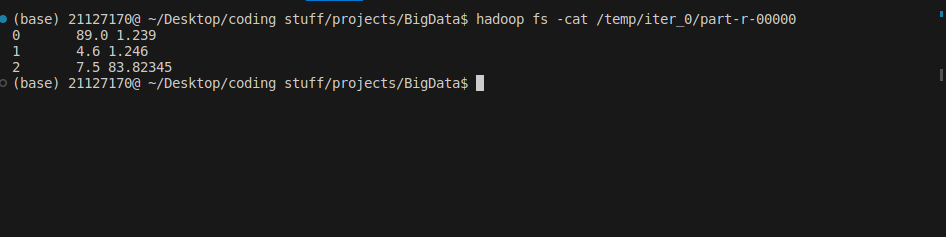
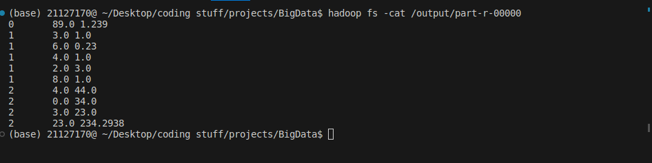

# Lab 01 Report: A Gentle Introduction to Hadoop

### Teacher in charge: Nguyễn Ngọc Thảo.

| Lab Instructors     |  Email                       | 
|---------------------|------------------------------|
| Đỗ Trọng Lễ         | dtle@selab.hcmus.edu.vn      |
| Bùi Huỳnh Trung Nam | huynhtrungnam2001@gmail.com  |

### Group Name : Left4Dead
| No. | Student ID | Student Name     |
|-----|------------|----------------- |
|  1  |  21127329  | Châu Tấn Kiệt    |
|  2  |  21127170  | Nguyễn Thế Thiện |
|  3  |  21127642  | Trịnh Minh Long  |

## Abstract

## Lab Progress
| No. | Task  | Expected output | Progress |
|-----|-------|-------------|---------|
|  1.1  |  Text Cleaning and Term Frequency | Students can count terms with MapReduce and output an MTX file  | 100% |
|  1.2  |  Low-Frequency Term Elimination  | Students can read MTX file and perform basic filtering | 100% |
|  1.3  |  Top 10 Most Frequent Words | Students can read MTX file and perform basic filtering | 100% |
|  1.4  |  TF-IDF | Students can read MTX file and perform advanced calculations with MapReduce | 100% |
|  1.5  |  Highest average TF-IDF  |  Students can perform advanced calculations with MapReduce  |  0%  |
|  2.1  |  K-Means on 2D Data  |  Students can apply iterative algorithms into MapReduce  | 100%  |
|  2.2  |  K-Means on Preprocessed Data  |  Students can combine the applications of iterative algorithms and advanced calculations into MapReduce  |  0%  |
|  2.3  |  Scalable K-Means++ Initialization  |  Students can combine the applications of iterative algorithms and advanced calculations into MapReduce  |  0%  |

## 1. Data preprocessing 
#### 1.1. 
#### 1.2.
#### 1.3.
#### 1.4.
#### 1.5.
## 2. K-Means Algorithm
#### 2.1. K-Means on 2D data
Note: The code is referenced based on [1]. Credit to "seraogianluca".

Data description: Data is only one text file consists of some 2D points. Each line consists of two float numbers divided by a space indicating the coordinations of a 2D point.
  

For the use of a small input file, the number of mapper and reducer shall be 1 (one) for the job. The main idea is to initialize randomized unique centroids and then perform Iterative Task, either though a fixed number of times or until the centroids converges, then performs the Final Task to output the class assignments after checking and achieving the completion criterias through MapReduce, and output the final centroids through HDFS DataOutputStream.

Execution: hadoop jar kMeansMain.jar kMeansMain /input /output \[num_of_clusters\] \[num_of_iterations\]

Iterative Task:
- Mapper \(kMeansMapper.java\): Using the Mapper.Context class to contain centroids info, we input the datapoints from the input directory, convert them to a Point class object, and then calculate the closest centroid for each datapoint. Then we output the key-value pair of \<key=centroid_index, value=datapoint\> \[Int, Text\].

- Reducer \(kMeansReducer.java\): Reducer shall group the key-value pairs that represent datapoints-centroids assignment, use that to calculate the average coordinations of such datapoints of a same group, resulting in new coordinations of the centroid of the group. We output the key-value pair of \<key=centroid_index, value=new_coordination\> \[Int, Text\] to folder \"\\temp\\iter_0\\", \"\\temp\\iter_1\\", ...

Final Task:
- Mapper \(kMeansMapper.java\): Same as Mapper in Iterative Task.
- Reducer \(kMeansFinal.java\): We do not do anything except outputing every key-value pair of \<key=centroid_index, value=new_coordination\> we gain from the Mapper that already does the job of assigning points to centroids \(clusters\), to file \"part-r-00000\" in the output directory.

- Challenges faced:
>- **No prior experience in configuring a multi-task Hadoop job.** It was indeed difficult to think of and implement a way to pass shared variables such as the centroids between Mapper and Reducer, and between the MapReduce tasks. This took us the most days in this entire lab to figure out Context class and HDFS DataIOStream.

#### 2.2.
#### 2.3.
## References
[1] seraogianluca, https://github.com/seraogianluca/k-means-mapreduce/tree/master, last visited: Mar 29th, 2024.