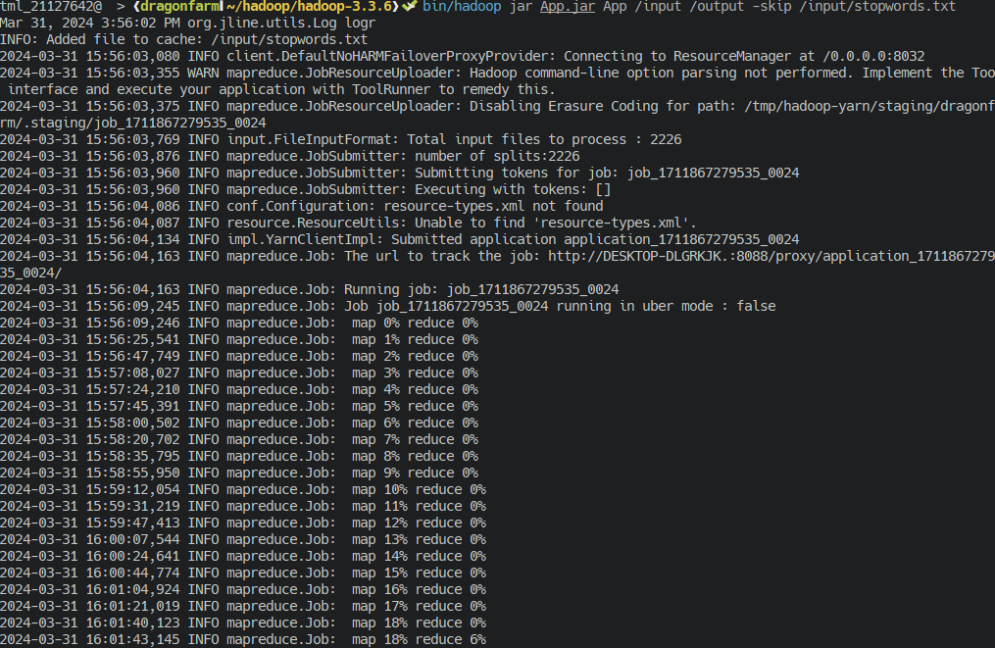
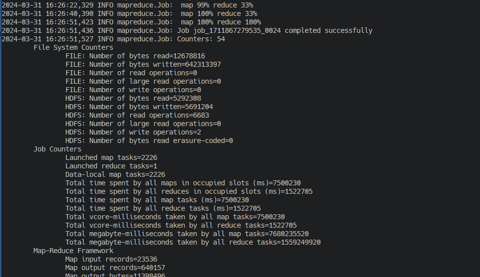
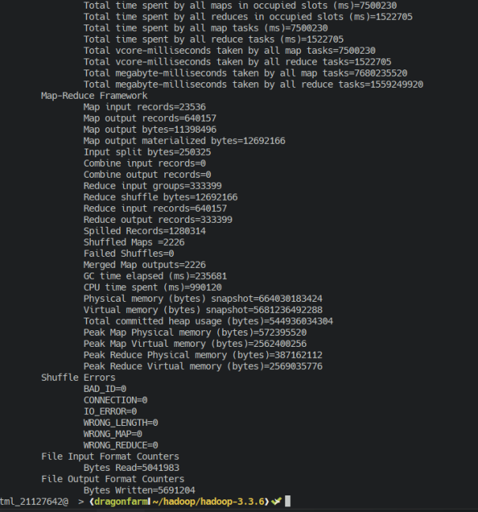
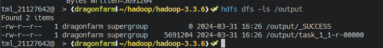
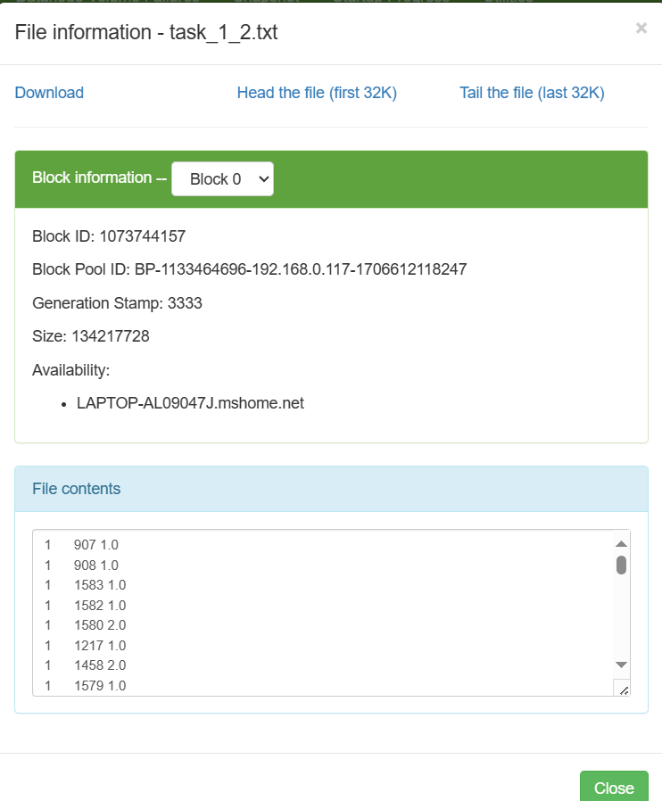
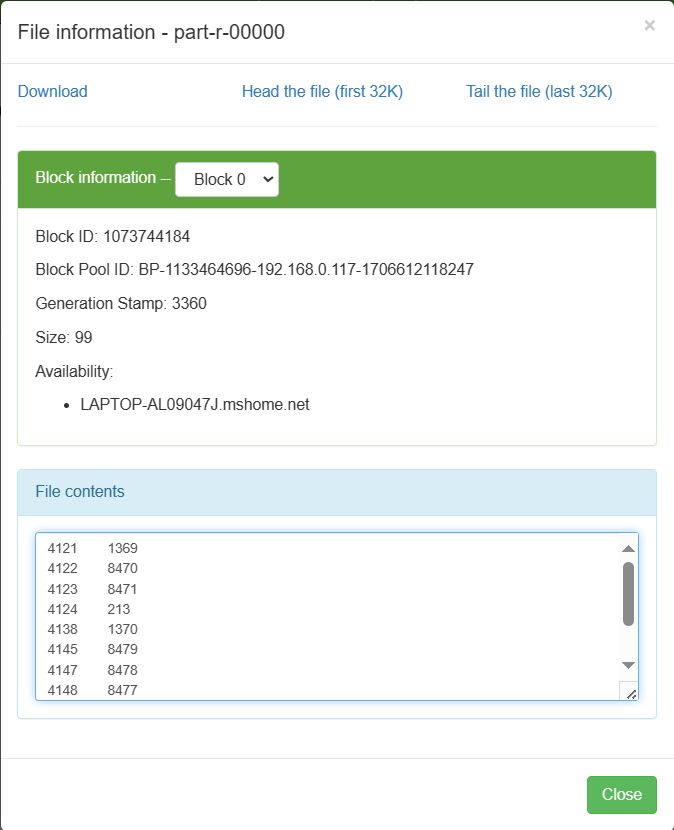
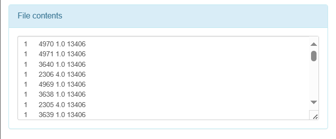
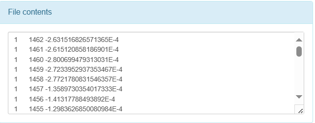

# Lab 01 Report: A Gentle Introduction to Hadoop

### Teacher in charge: Nguyễn Ngọc Thảo.

| Lab Instructors     |  Email                       | 
|---------------------|------------------------------|
| Đỗ Trọng Lễ         | dtle@selab.hcmus.edu.vn      |
| Bùi Huỳnh Trung Nam | huynhtrungnam2001@gmail.com  |

### Group Name : Left4Dead
| No. | Student ID | Student Name     |
|-----|------------|----------------- |
|  1  |  21127329  | Châu Tấn Kiệt    |
|  2  |  21127170  | Nguyễn Thế Thiện |
|  3  |  21127642  | Trịnh Minh Long  |

## Abstract


## Lab Progress
| No. | Task  | Expected output | Progress |
|-----|-------|-------------|---------|
|  1.1  |  Text Cleaning and Term Frequency | Students can count terms with MapReduce and output an MTX file  | 100% |
|  1.2  |  Low-Frequency Term Elimination  | Students can read MTX file and perform basic filtering | 100% |
|  1.3  |  Top 10 Most Frequent Words | Students can read MTX file and perform basic filtering | 100% |
|  1.4  |  TF-IDF | Students can read MTX file and perform advanced calculations with MapReduce | 100% |
|  1.5  |  Highest average TF-IDF  |  Students can perform advanced calculations with MapReduce  |  0%  |
|  2.1  |  K-Means on 2D Data  |  Students can apply iterative algorithms into MapReduce  | 100%  |
|  2.2  |  K-Means on Preprocessed Data  |  Students can combine the applications of iterative algorithms and advanced calculations into MapReduce  |  0%  |
|  2.3  |  Scalable K-Means++ Initialization  |  Students can combine the applications of iterative algorithms and advanced calculations into MapReduce  |  0%  |

## 1. Data preprocessing 
#### 1.1. 
- Data description:
  + Multiple folders containing lots of input file in ".txt" format.
  + stopwords.txt file.
- Execution: ```bin/hadoop App.jar App <input/path> <output/path> -skip <path/to/stopwords/file>```
- Job implementation:
  1. Number of mapper: 1
  2. Number of reducer: 1
  3. Tasks:
    + Mapper:
      * It takes three parameters: Object key, Text value, and Context context. The key represents the input key, value represents the input value (usually a line of text), and context is used to emit output from the mapper.
      * First the input text "value" is tonkenized using StringTokenizer library
      * Then, we get the path of the input (path to the input file), then extract the name of the folder.
      * Check if the name of the current file is "stopwords.txt", ignore all next processes if it true.
      * Emits key-value pairs for each word, where the key includes the word and the folder name (Ex: "hello-economy"). This will be used in reducer to avoid counting duplicate word but is in another folder.
      * Write key-value pairs to context.
    + Reducer:
      * Takes three parameters: key, values, and context.
      * Iterates through the values, which are IntWritable objects.
      * Sums up the values to calculate the total count for each key.
      * Emits key-value pairs where the key look this this "hello  economy" (hello+"\t"+economy), and the value is the total count.
      * Write key-value pairs to context.
    + Final tasks:
       * Then, write the values in context to output folder named "task_1_1-r-00000".
  4. Results:
    - Run command:
      
    - Job completed:
      
    - Extra information: <br>
      
    - Output files: <br>
      
   5. Challenges faced:
    >- Hard to implement the code for getting input path
    >- Can't find any source for write the ouput to custom file. For example: "task_1_1.mtx" instead of "task_1_1-r-00000".
        (a lots of methods are from old version and won't work with my current hadoop version: 3.3.6)
#### 1.2. Low-Frequency Term Elimination
 1. Tasks:
  + Mapper:
    - Read the input file 
    - Use Stringtokenizer to read each line
    - Set the termID as key, docID and frequency as value
  + Reducer: 
    - Split the value to docID and frequency and put them into a Map
    - Count the frequency of each term with the frequency
    - If the frequency of the word is > 3, print out both the docID and frequency
 2. Challenges
  >- At first I didn;'t know how to count without interfering the docID, but I realized there's a Map data type

  - Output: 
  
#### 1.3. Top 10 Most Frequent Words
 1. Tasks:
  + Mapper:
    - Read the input file 
    - Use Stringtokenizer to read each line
    - Set the termID as key, frequency as value
  + Reducer: 
    - Initialize a TreeMap to store the word and its frequency
    - Count the frequency of each term by adding the frequency 
    - Put the termID and frequency to the TreeMap
    - If length of TreeMap > 10, we remove its first key, or the smallest component
    - Loop until 10 to show the top 10 most frequent terms
 2. Challenges
  >- It's challenging to find the way to rank the frequency
  - Output: 
  
Output: 
#### 1.4. TF-IDF
In this section, there are 2 Mappers and 2 Reducers
  1. Tasks:
  + Mapper 1:
    - Read the input file 
    - Use Stringtokenizer to read each line
    - Set the docID as key, termID and frequency as value
  + Reducer 1: 
    - Initialize a TreeMap to store the word and its frequency
    - Count the number of words in each document
  - Output: 
  
  + Mapper 2:
    - Read the input file 
    - Use Stringtokenizer to read each line
    - Set the docID as key, termID and frequency and docWords as value
  + Reducer 2: 
    - Calculate TF-IDF using the formula:
    - `tf(t,d)`: count of t in d / number of words in d
    - `idf(t)`: log(N/ df(t))
    - `tf-idf` : `tf` * `idf`
 2. Challenges
  >- I couldn't use 2 Mappers and Reducer and apply that into 1 output file, which means I have to create 1 text file as an intermediate file to the final output, this cost a large amount of disk usage.
  - Output: 
  
#### 1.5.
## 2. K-Means Algorithm
#### 2.1. K-Means on 2D data
Note: The code is referenced based on [1]. Credit to "seraogianluca".

Data description: Data is only one text file consists of some 2D points. Each line consists of two float numbers divided by a space indicating the coordinations of a 2D point.
  

For the use of a small input file, the number of mapper and reducer shall be 1 (one) for the job. The main idea is to initialize randomized unique centroids and then perform Iterative Task, either though a fixed number of times or until the centroids converges, then performs the Final Task to output the class assignments after checking and achieving the completion criterias through MapReduce, and output the final centroids through HDFS DataOutputStream.

Execution: hadoop jar kMeansMain.jar kMeansMain /input /output \[num_of_clusters\] \[num_of_iterations\]


Iterative Task:
- Mapper \(kMeansMapper.java\): Using the Mapper.Context class to contain centroids info, we input the datapoints from the input directory, convert them to a Point class object, and then calculate the closest centroid for each datapoint. Then we output the key-value pair of \<key=centroid_index, value=datapoint\> \[Int, Text\].

- Reducer \(kMeansReducer.java\): Reducer shall group the key-value pairs that represent datapoints-centroids assignment, use that to calculate the average coordinations of such datapoints of a same group, resulting in new coordinations of the centroid of the group. We output the key-value pair of \<key=centroid_index, value=new_coordination\> \[Int, Text\] to folder \"\\temp\\iter_0\\", \"\\temp\\iter_1\\", ...


Final Task:
- Mapper \(kMeansMapper.java\): Same as Mapper in Iterative Task.
- Reducer \(kMeansFinal.java\): We do not do anything except outputing every key-value pair of \<key=centroid_index, value=new_coordination\> we gain from the Mapper that already does the job of assigning points to centroids \(clusters\), to file \"part-r-00000\" in the output directory.


- Challenges faced:
>- **No prior experience in configuring a multi-task Hadoop job.** It was indeed difficult to think of and implement a way to pass shared variables such as the centroids between Mapper and Reducer, and between the MapReduce tasks. This took us the most days in this entire lab to figure out Context class and HDFS DataIOStream.

#### 2.2.
#### 2.3.
## References
- [1] seraogianluca (2021), https://github.com/seraogianluca/k-means-mapreduce/tree/master, last visited: Mar 29th, 2024.
- [2] https://stackoverflow.com/questions/19012482/how-to-get-the-input-file-name-in-the-mapper-in-a-hadoop-program. Thanks Hans Brende for the workaround of getting input path
- [3]
